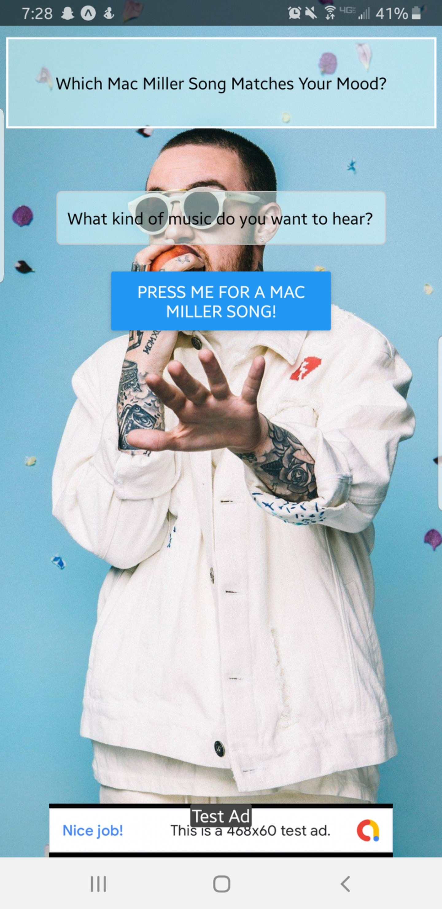

# mac-mood-app
The app asks you which mood you are in, and then gives the name of a random song from a hardcoded list by Mac Miller that evokes the mood selected

## What I Learned
* React Native
* SearchableDropdown (Dropdown Menu)
* Arrays of Objects
* State Management
* "Randomizing" Which Item Gets Selected From an Array
* CSS Styling
* AdMobBanner (Banner Ads)

## Screenshots

  
  
  

